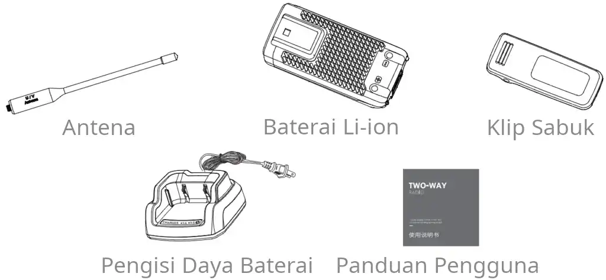
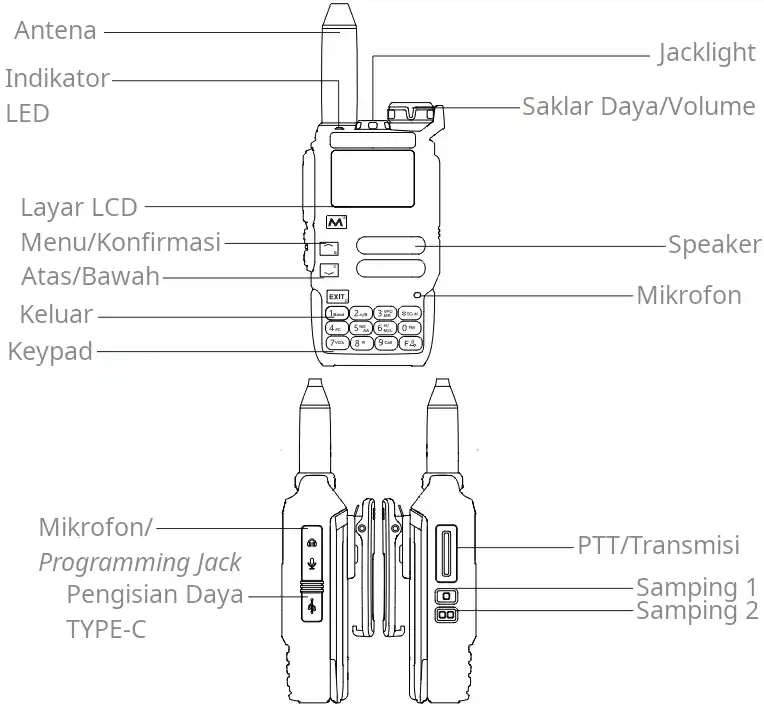

```
RADIO DUA-ARAH MULTIFUNGSI

Panduan Pengguna Super

Analisa Spektrum Frekuensi/Salin Cepat Satu Kanal/VOX/
Transmisi Multi-Band dan Penerimaan 18∽660MHz 840∽1300MHz/
Pengisian Daya TYPE-C dan Basis-dudukan/200 Kanal/
Radio FM Fungsional/Demodulasi USB-AM-FM/SMS
```

## PERHATIAN SEBELUM MENGGUNAKAN

Radio ini menggabungkan desain luar biasa dan teknologi canggih terkini.
Saran berikut akan membantu Anda memenuhi kewajiban Anda dalam bergaransi.
Dan ini memberi Anda informasi penting tentang cara mengoperasikan radio portabel ini dengan aman.
- Harap letakkan radio dan aksesorinya di tempat yang tidak dapat dijangkau oleh anak-anak yang rewel.
- Pemeliharaan hanya dapat dilakukan oleh teknisi profesional, jika tidak ingin menghancurkan radio.
- Harap gunakan baterai dan pengisi daya standar agar tidak menghancurkan radio.
- Harap gunakan antena standar atau gunakan yang asli, agar tidak memperpendek jarak komunikasi.
- Jangan biarkan radio terkena sinar matahari dalam waktu lama, atau meletakkannya di dekat api.
- Jangan meletakkan radio di lingkungan yang sangat berdebu atau basah.
- Jangan membersihkan radio dengan produk kimia yang keras, bahan pembersih atau bahan pencuci yang kuat.
- Jangan melakukan transmisi saat antena tidak dipasang.
- Jika Anda menemukan bau tidak sedap atau kabut asap, segera matikan radio.
  Dan lepas baterai radio, lalu hubungi agen terkait.

## Catatan Pengisian Daya

- Paket baterai tidak diisi dayanya saat dikirim. Isilah dayanya sebelum digunakan.
- Mengisi daya baterai terlebih dahulu setelah pembelian atau penyimpanan yang lama
  (lebih dari 2 bulan) tidak akan membuat baterai mencapai kapasitas terbesar atau daya normalnya,
  yang hanya dapat dilakukan setelah pengisian dan pengosongan berulang kali dua atau tiga kali.
- Jangan gunakan radio saat mengisi daya. Hal ini akan memengaruhi pengisian normal baterai,
  menyebabkan kerusakan pada radio dan kecelakaan.
- Setelah baterai terisi penuh, harap keluarkan dari dudukan pengisi daya.
  Jangan isi dayanya lagi sebelum daya baterai benar-benar habis.
  Atau itu akan merusak efek memori baterai.
- Meskipun menggunakan cara pengisian daya yang benar,
  tetapi jika baterai tidak bertambah kapasitasnya atau tidak dapat digunakan,
  ini berarti masa pakai baterai hampir habis, harap ganti dengan baterai baru.
- Harap gunakan baterai dan pengisi daya asli pabrikan. Mereka tersedia di agen lokal Anda.
- Jika Anda memiliki pertanyaan tentang baterai dan aksesori yang bukan asli pabrikan,
  mohon jangan menggunakannya. Atau akan menyebabkan kecelakaan berbahaya.

## Instruksi Pengisi Daya Basis-dudukan

- Colokkan baterai litium atau radio yang terpasang dengan baterai litium ke dudukan pengisi daya,
  dan pastikan baterai berada dalam kontak normal dengan dudukan pengisi daya.
- Lampu hijau menyala stabil saat dudukan pengisi daya tidak digunakan; Ketika lampu merah menyala,
  pengisian daya dimulai; Saat penuh, lampu hijau menyala stabil.
- Setelah baterai litium terisi penuh, keluarkan dari pengisi daya.

## Instruksi Pengisi Daya TYPE-C

- Pengisi daya TYPE-C hanya digunakan untuk pengisian daya darurat.
  Gunakan pengisi daya basis-dudukan untuk pengisian daya normal.
- Logo kepala pengisian daya TYPE-C ditampilkan pada layar saat dimulai dan mengisi daya.
- Mematikan tidak memengaruhi pengisian daya TYPE-C.
- Saat mengisi daya, indikator LED biru akan menyala lama,
  dan akan berkedip untuk menandakan bahwa pengisian daya akan segera selesai.
- Setelah pengisian daya TYPE-C, indikator LED biru akan dimatikan.
- Jangan melepas baterai saat mengisi daya melalui TYPE-C.

> Terdapat dua versi dari seri ini:  
> Radio dengan pengisian daya TYPE-C; Radio B tidak memiliki pengisian daya TYPE-C.  
> Konfigurasi produk sesuai dengan pembelian Anda yang sebenarnya.

### Catatan

1. Saat mengisi daya radio (baik basis-dudukan maupun TYPE-C),
   dilarang melakukan transmisi untuk menghindari kerusakan pada radio dan bahaya yang tidak disengaja.
2. Saat daya radio terisi (baik basis-dudukan maupun TYPE-C), efek penerimaan akan terpengaruh.
3. Jangan menyebabkan hubungan arus pendek pada terminal baterai atau membuang baterai ke dalam api.
4. Jangan melepas penutup baterai tanpa izin.

## Mem-*flash* Firmware

Melakukan pembaruan firmware ialah memungkinkan melalui program terpisah, tetapi itu bahkan lebih
sederhana dan mudah melalui program peramban web yang berbasis Chromium: Edge, Opera, dsb.

1. Gunakan kabel pemrograman dengan tipe konektor Kenwood K-plug
   ([Baofeng](https://www.baofengradio.com/products/baofeng-programming-cable), dsb.), dan sambungkan USB ke komputer;
2. Matikan radio dengan memutar knob ke kanan hingga "klik";
3. Hidupkan radio dalam mode pemrograman dengan menekan dan tahan tombol PTT, lalu putar knob ke kiri. Kemudian,
   lepaskan PTT dan pastikan jacklight menyala stabil yang menandakan radio sedang dalam mode pemrograman;
4. Sambungkan K-plug kabel pemrograman ke radio dengan "pas" untuk memastikan radio terhubung dengan baik;
5. Pada peramban web komputer Anda, buka halaman URL https://kamilsss655.github.io/uvtools/?firmwareURL=https://github.com/kamilsss655/uv-k5-firmware-custom/releases/download/v.20.5/firmware.packed.bin
   dan tunggu beberapa saat hingga log menunjukkan keluaran sebagai berikut.
   ```
   Loading file from url: https://github.com/kamilsss655/uv-k5-firmware-custom/releases/download/v.20.5/firmware.packed.bin

   CRC check passed...
   Detected firmware version: *NUNU v.20.5
   Firmware uses 99.08% of available memory (60872/61439 bytes).
   ```
   Kemudian, klik "Flash firmware" dan muncul jendela, pilih USB serial yang sesuai dan klik sambungkan.
   Jacklight radio akan menyala berkedip yang menandakan radio sedang dalam pembaruan firmware;
6. Tunggu hingga persentase proses 100% dengan "Successfully flashed firmware." pada antarmuka log dari peramban web;
7. Ketika selesai, putuskan sambungan kabel pemrograman yang menghubungkan radio dengan komputer. Kemudian,
   lakukan pengaturan ulang radio (ALL reset) dengan pergi ke parameter `Reset` pada menu.

## Fitur Utama

- *200 Channel*
- *Cross-Band Intercom*
- *1750Hz Call Tone*
- *Program On Site*
- *Functional FM Radio*
- *10-Group Scrambler*
- *Multi-Scan Range Adjustable*
- *CTCSS/DCS*
- *Remote Kill/Revive*
- *Keypad Lock*
- *Jacklight*
- *PC Programmable/Hackable*
- *Busy Channel Lock*
- *VOX*
- *Dual-watch Operation*
- *Time-Out-Timer*
- *VFO/ALL Reset*
- *Large LCD Display*
- *Voice Prompt*
- *Reminding Switch*
- *Multi Display of Channel No./Channel Frequency/Channel Name*
- *H (High), M (Medium), and L (Low) Output Power Selective*
- *Multi-Band Transmitting & 18∽660MHz 840∽1300MHz Receiving*
- *Receive/Transmit Code Settings Separately*
- *High Capacity Battery\Long Standby Time*
- *Fast Copy One Channel (ACT AS FREQUENCY METER (FOR TWO-WAY RADIO & SOME OTHER DEVICES))*
- *Power-on Password Protection*
- *USB/AM/FM Aviation Band Receiving*
- *Reverse Frequency Function*
- *TYPE-C and Charger-base Charging*
- *Wide/Narrow Bandwidth Adjustable*
- *Offset Frequency Direction Set1*
- *Wireless Radio Replication*
- *Squelch Level Adjustable*
- *Repeater Forwarding Confirmation Function*
- *Frequency and Channel Mode Shift*
- *Offset Frequency Settings*
- *Channel Scan and Add*
- *Backlight Auto Off Time Selective*
- *Automatic Signaling Search*
- *Multi Step Frequency*
- *One Key Call Channel*
- *Fast and Advanced Frequency Spectrum Analyzer*
- *Encryptable Messaging and Message Hopping Mesh (NUNU PROTOCOL)*
- *Configurable Button Functions (SHORT & LONG SIDE 1/SIDE 2/MENU)*
- *Battery Voltage Calibration (FOR PERCENTAGE MEASURING)*
- *Informative UI with useful meters*

## Aksesori Yang Disertakan

Buka kemasan radio portabel dengan hati-hati.
Kami menyarankan Anda memeriksa barang-barang berikut sebelum membuang bahan kemasan.

### Aksesori Standar

| Barang | Jumlah |
|:---|:---:|
| Radio Portabel | 1 |
| Antena | 1 |
| Baterai Li-ion | 1 |
| Pengisi Daya Baterai | 1 |
| Klip Sabuk | 1 |
| Panduan Pengguna | 1 |

### Foto Aksesori



## Diagram Radio



<p align="center">
Fungsi pengisian daya TYPE-C pada rangkaian produk ini bersifat opsional.<br>
Konfigurasi produk sesuai dengan pembelian Anda yang sebenarnya.
</p>

## Tampilan LCD

Anda dapat memeriksa simbol-simbol berbeda yang ditunjuk pada LCD.

| :triangular_flag_on_post: | <b>BAGIAN INI TIDAK LENGKAP.</b> |
|---------------------------|:---------------------------------|

## Tombol

### Tombol PTT (Tombol Transmisi)

**Tombol Saklar Transmisi/Penerimaan.**

Tekan "PTT" untuk mengirim dan berbicara ke mikrofon. Lepaskan "PTT" untuk menerima.

### Tombol Fungsi Yang Dapat Diatur Dan Fungsinya

| Fungsi | Aksi |
|:---|:---|
| `NONE` | Tiada aksi. |
| `FLASH LIGHT` | Non/Aktifkan fungsi Jacklight: NYALA/KEDIP/SOS. |
| `POWER` | Ubah Daya Keluaran Radio: H (TINGGI)/M (SEDANG)/L (RENDAH). |
| `MONITOR` | Non/Aktifkan fungsi Monitor. |
| `SCAN` | Mulai Pemindaian pada mode kanal/frekuensi. |
| `VOX` | Non/Aktifkan VOX, transmisikan suara secara terus-menerus. |
| `FM RADIO` | Non/Aktifkan mode Radio FM. |
| `LOCK KEYPAD` | Buka/Kunci Tombol Keypad. |
| `SWITCH VFO` | Beralih VFO utama: ATAS/BAWAH. |
| `VFO/MR` | Ubah mode aktif saat ini: SALURAN/FREKUENSI (MR/VFO). |
| `SWITCH DEMODUL` | Ubah Demodulasi: USB (SSB)/AM/FM. |
| `SWITCH BANDWIDTH` | Ubah Lebar Pita saat ini. |
| `SPECTRUM` | Aktifkan mode Analisa Spektrum Frekuensi pada mode kanal/frekuensi. |

**Fungsi Yang Disarankan**

| Menu | Fungsi | Aksi |
|:---|:---|:---|
| `F1Shrt` | `MONITOR` | Tekan sebentar untuk mengaktifkan fungsi Monitor. |
| `F1Long` | `SPECTRUM` | Tekan lama untuk mengaktifkan mode Analisa Spektrum Frekuensi. |
| `F2Shrt` | `SWITCH VFO` | Tekan sebentar untuk beralih VFO utama. |
| `F2Long` | `SWITCH DEMODUL` | Tekan lama untuk mengubah Demodulasi. |
| `M Long` | `FLASH LIGHT` | Tekan lama untuk mengaktifkan fungsi Jacklight. |

### Tombol Keypad (Sebelah Depan)

#### *`M`* – Tombol Menu/Konfirmasi

1. Di halaman utama, tekan sebentar untuk masuk ke menu,
   pilih item menu dan tekan tombol *`M`* untuk mengonfirmasi parameter.
2. Dalam Pemindaian kanal/frekuensi, tekan sebentar untuk
   mempertahankan/menampilkan kanal terakhir yang ditemukan pada layar.
3. Tekan lama tombol ini untuk aksi dari fungsi yang telah diatur pada menu.
   Lihat "Tombol Fungsi Yang Dapat Diatur Dan Fungsinya" di atas.

#### `▲` – Tombol Navigasi Atas

1. Dalam halaman menu, tekan untuk memindahkan fokus pilihan item ke atas.
2. Selain nomor satu (1), tekan untuk mengubah pilihan yang aktif saat ini ke atas.

#### `▼` – Tombol Navigasi Bawah

1. Dalam halaman menu, tekan untuk memindahkan fokus pilihan item ke bawah.
2. Selain nomor satu (1), tekan untuk mengubah pilihan yang aktif saat ini ke bawah.

#### *`EXIT`* – Tombol Keluar/Hapus

1. Dalam status Pengaturan, tekan sebentar untuk keluar dan masuk kembali ke menu atas;
   tekan lama untuk keluar dan sampai kembali ke halaman utama. Lihat nomor satu (1) dari tombol *`M`* di atas.
2. Dalam status Masukan, tekan sebentar untuk menghapus satu aksara dari info masukan;
   tekan lama untuk menghapus seluruh info masukan.

#### `5` – Tombol 5/~~NOAA~~

1. Dalam mode kanal, tekan lama untuk mengubah daftar pindaian
   yang diatur ke kanal yang dipilih: I/II.
2. Dalam mode frekuensi, tekan lama untuk
   mengaktifkan fungsi Rentang Pemindaian Frekuensi.

#### `*` – Tombol Bintang/Pemindaian

1. Tekan sebentar tombol `*` untuk masuk ke panggilan manual dan halaman panggilan (DTMF).
2. Dalam mode kanal, tekan lama untuk mulai Pemindaian kanal.
3. Dalam mode frekuensi, tekan lama untuk mulai Pemindaian frekuensi,
   dapat difungsikan dengan Rentang Pemindaian Frekuensi.
4. Saat Pemindaian kanal sedang berlangsung,
   tekan untuk mengubah daftar pindaian: I/II/SEMUA.

#### `F` – Tombol Kombinasi Fungsi

1. Tekan sebentar tombol `F`. Kemudian, tekan tombol dari rentang `0` hingga
   `9`, atau tombol `*`, untuk cepat-terapkan peralihan fungsi tombol.
2. Tekan lama tombol ini untuk buka/kunci seluruh tombol keypad.

| Kombinasi | Fungsi | Aksi |
|:---|:---|:---|
| `F` + *`M`* | MESSENGER | Mengaktifkan mode SMS untuk frekuensi saat ini. |
| `F` + `1` | BAND | Mengalihkan Band Frekuensi dalam mode frekuensi: 1-7+ (1GHz+). Pengaturan kanal disalin ke mode frekuensi dalam mode kanal. |
| `F` + `2` | A/B | Mengalihkan Kanal/Frekuensi (MR/VFO) utama, yang ditandai dengan panah-kanan: ATAS/BAWAH. |
| `F` + `3` | VFO/MR | Mengubah mode aktif saat ini: SALURAN/FREKUENSI (MR/VFO). |
| `F` + `4` | FC | Mengaktifkan mode Salin Cepat Satu Kanal, simpan data dengan tombol *`M`*. |
| `F` + `5` | ~~NOAA~~ | Mengaktifkan mode Analisa Spektrum Frekuensi. |
| `F` + `6` | H/M/L | Mengubah Daya Keluaran Radio: H (TINGGI)/M (SEDANG)/L (RENDAH). |
| `F` + `7` | VOX | Mengaktifkan VOX, transmisikan suara secara terus-menerus. |
| `F` + `8` | R | Mengaktifkan mode Terbalik untuk kanal yang frekuensi-*offset*-nya diatur, menimpa frekuensi TX dengan RX. |
| `F` + `9` | CALL | Mengalihkan kanal saat ini ke kanal Panggilan Darurat `1 Call` yang diatur pada menu. |
| `F` + `*` | SCAN | Mengaktifkan Pemindai CTCSS/DCS untuk frekuensi saat ini. |
| `F` + `0` | FM | Mengaktifkan mode Radio FM. |

## Informasi Menu

Tekan sebentar tombol *`M`* untuk masuk ke menu; Tekan tombol `▲`/`▼` untuk menavigasi pilihan/parameter,
dan tekan tombol *`M`* untuk mengonfirmasi parameter; Tekan sebentar tombol *`EXIT`* untuk kembali ke menu atas.
Tekan lama tombol *`EXIT`* untuk kembali ke halaman utama.

| No. | Parameter | Fungsi | Pilihan Parameter |
|:---|:---|:---|:---|
| 1 | `Step` | Langkah Frekuensi dalam kHz. | 0.01, 0.05, 0.10, 0.25, 0.50, 1.00, 1.25, 2.50, 5.00, 6.25, 8.33, 10.00, 12.50, 15.00, 25.00, 30.00, 50.00, 100.00, 125.00, 250.00, 500.00. |
| 2 | `Bandw` | Lebar Pita yang digunakan dan ditampilkan dalam format k(ilo), daripada N(arrow)/W(ide). | 5, 6.25, 8.33, 12.5, 25. |
| 3 | `TxPwr` | Daya Keluaran Radio; VHF 144MHz: H ~4.6W, M ~3W, L ~1W. | LOW, MID, HIGH. |
| 4 | `RxDCS` | *Receiver Digital-Coded Squelch*, jika mengaktifkan ini, maka *squelch* hanya akan terbuka bila kode ini diterima. | ... |
| 5 | `RxCTCS` | *Receiver Continuous Tone-Coded Squelch System*, *squelch* hanya akan terbuka bila kode ini diterima. | ... |
| 6 | `TxDCS` | *Transmitter Digital-Coded Squelch*, radio akan mengirimkan kode yang diberikan saat melakukan transmisi. | ... |
| 7 | `TxCTCS` | *Transmitter Continuous Tone-Coded Squelch System*, radio akan mengirimkan kode yang diberikan saat melakukan transmisi. | ... |
| 8 | `TxODir` | Arah *Offset* Frekuensi Pemancar. | OFF, -, +. |
| 9 | `TxOffs` | Nilai *Offset* Frekuensi Pemancar. | Isi manual dalam MHz! |
| 10 | `RxOffs` | Nilai *Offset* Frekuensi Penerima. | Isi manual dalam MHz! |
| 11 | `Scramb` | Pengacak, distorsikan audio agar tidak dapat dipahami oleh pendengar lain. Jika radio menggunakan pengaturan yang sama, maka mereka dapat berkomunikasi dengan jelas. | OFF, 2600Hz, 2700Hz, 2800Hz, 2900Hz, 3000Hz, 3100Hz, 3200Hz, 3300Hz, 3400Hz, 3500Hz. |
| 12 | `BusyCL` | Penguncian Kanal Sibuk, halangi transmisi radio karena sinyal diterima; dengan *BUSY* pada layar saat tombol PTT ditekan. | OFF, ON. |
| 13 | `Compnd` | Kompander, *compressor-expander*, memungkinkan sinyal dengan rentang dinamis besar ditransmisikan melalui fasilitas yang memiliki kemampuan rentang dinamis lebih kecil. Ini meningkatkan kualitas audio dan kedua radio harus menggunakan pengaturan yang sama. | OFF, TX, RX, TX/RX. |
| 14 | `Demodu` | Mode Demodulator, FM untuk umum, AM/USB (SSB) hanya untuk mendengarkan/monitor. | FM, AM, USB. |
| 15 | `RxAGC` | AGC Penerima yang berlaku untuk semua modulasi, memungkinkan melindungi radio dari gangguan yang disebabkan oleh penerimaan sinyal kuat. Pengaturan SLOW dengan rentang dinamis besar ideal secara keseluruhan dan mungkin berguna untuk stasiun HF-AM yang menyiarkan musik, FAST dengan rentang dinamis lebih kecil ideal untuk aviasi komunikasi singkat yang mana setiap kata sangatlah penting. | OFF, SLOW, FAST. |
| 16 | `ScAdd1` | Tambahkan kanal ke daftar Pindaian Satu (I). | OFF, ON. |
| 17 | `ScAdd2` | Tambahkan kanal ke daftar Pindaian Dua (II). | OFF, ON. |
| 18 | `ChSave` | Simpan frekuensi dan pengaturan saat ini ke kanal-memori. | Pilih manual kanal yang ingin disimpan dan ditimpa! |
| 19 | `ChDele` | Hapus kanal-memori yang tersimpan. | Pilih manual kanal yang ingin dihapus! |
| 20 | `ChName` | Ubah nama kanal-memori yang tersimpan. | Pilih manual kanal yang ingin diubah namanya! |
| 21 | `ScnRev` | Mode Pemindaian Kelanjutan. Pengaturan CARRIER akan melanjutkan pemindaian setelah sinyal lenyap, TIMEOUT akan melanjutkan pemindaian setelah lima (5) detik jeda, sedangkan STOP akan menghentikan pemindaian setelah sinyal diterima. | CARRIER, TIMEOUT, STOP. |
| 22 | `F1Shrt` | Fungsi Tekan Sebentar Tombol Samping 1. | Lihat "Tombol Fungsi Yang Dapat Diatur Dan Fungsinya" di atas! |
| 23 | `F1Long` | Fungsi Tekan Lama Tombol Samping 1. | Lihat "Tombol Fungsi Yang Dapat Diatur Dan Fungsinya" di atas! |
| 24 | `F2Shrt` | Fungsi Tekan Sebentar Tombol Samping 2. | Lihat "Tombol Fungsi Yang Dapat Diatur Dan Fungsinya" di atas! |
| 25 | `F2Long` | Fungsi Tekan Lama Tombol Samping 2. | Lihat "Tombol Fungsi Yang Dapat Diatur Dan Fungsinya" di atas! |
| 26 | `M Long` | Fungsi Tekan Lama Tombol Menu. | Lihat "Tombol Fungsi Yang Dapat Diatur Dan Fungsinya" di atas! |
| 27 | `KeyLck` | Kunci Tombol Keypad Otomatis. | OFF, AUTO. |
| 28 | `TxTOut` | Batas Waktu Maksimal untuk melakukan Transmisi. | 30 sec, 1 min, 2 min, 3 min, 4 min, 5 min, 6 min, 7 min, 8 min, 9 min, 15 min. |
| 29 | `BatSav` | Hemat Baterai ketika baterai mencapai persentase yang diatur. | OFF, 50%, 67%, 75%, 80%. |
| 30 | `Mic` | Sensitivitas Mikrofon. | +1.1dB, +4.0dB, +8.0dB, +12.0dB, +15.1dB. |
| 31 | `ChDisp` | Gaya Tampilan Kanal yang ditampilkan pada layar. | FREQ, CHANNEL NUMBER, NAME, NAME + FREQ. |
| 32 | `POnMsg` | Tampilkan Pesan sesaat Daya Hidup. | NONE, FULL, MESSAGE, VOLTAGE. |
| 33 | `BatTxt` | Tampilkan Nilai Baterai tambahan pada status dalam persentase atau voltase. | NONE, VOLTAGE, PERCENT. |
| 34 | `BackLt` | Durasi Nyala Lampu Latar Belakang. | OFF, 5 sec, 10 sec, 20 sec, 1 min, 2 min, 4 min, ON. |
| 35 | `BLMin` | Kecerahan Minimal Lampu Latar Belakang. Saat lampu latar belakang layar padam, maka akan diredupkan ke nilai ini. | 0, 1, 2, 3, 4, 5, 6, 7, 8, 9. |
| 36 | `BLMax` | Kecerahan Maksimal Lampu Latar Belakang. Saat lampu latar belakang layar menyala, maka akan dicerahkan ke nilai ini. | 1, 2, 3, 4, 5, 6, 7, 8, 9, 10. |
| 37 | `BltTRX` | Aktivasi Lampu Latar Belakang saat transmisi (TX) atau penerimaan (RX). | OFF, TX, RX, TX/RX. |
| 38 | `Beep` | Suara Beep saat tombol keypad ditekan. | OFF, ON. |
| 39 | `Roger` | Tanda Roger selepas melakukan transmisi. | OFF, ROGER, MDC. |
| 40 | `SqTone` | Nada Ekor *Squelch* yang digunakan untuk TX/RX saat CTCSS/DCS digunakan. Standar ialah 55.0Hz. | ... |
| 41 | `1 Call` | Satu Tombol Memanggil Kanal, memungkinkan cepat-beralih ke kanal yang diatur dengan tombol kombinasi `F` + `9`. | Pilih manual kanal yang ingin diterapkan! |
| 42 | `D Live` | Tampilkan kode DTMF yang diterima di tengah pada layar. | OFF, ON. |
| 43 | `VOXSen` | Sensitivitas VOX. Atur tingkat sensitivitas suara aktivasi-TX, atau matikan sepenuhnya. | ... |
| 44 | `VOXDel` | Keterlambatan VOX. Atur jarak keterlambatan suara aktivasi-TX yang mungkin berguna untuk paket radio, APRS, dan lain-lain. | ... |
| 45 | `BatVol` | Informasi Voltase dan Persentase Baterai. Hanya menampilkan informasi terkait. | |
| 46 | `RxMode` | Mode Penerimaan. Atur bagaimana frekuensi atas-bawah pada antarmuka akan digunakan. Pengaturan MAIN ONLY akan selalu mentransmisikan dan mendengarkan frekuensi utama, DUAL RX RESPOND dengan status `DWR` pada layar akan mendengarkan kedua frekuensi, CROSS BAND dengan status `XB` pada layar akan selalu mentransmisikan frekuensi utama dan mendengarkan frekuensi kedua, sedangkan MAIN TX DUAL RX dengan status `DW` pada layar akan mentransmisikan frekuensi utama dan mendengarkan kedua frekuensi. | MAIN ONLY, DUAL RX RESPOND, CROSS BAND, MAIN TX DUAL RX. |
| 47 | `Passwd` | Atur Sandi PIN sesaat radio diaktifkan. Atur dengan memasukkan nomor PIN pada tombol keypad dan tekan tombol *`M`* untuk mengonfirmasi, OFF akan menonaktifkannya. Apabila gagal memasukkan sandi ketika mengaktifkan radio, sampai tiga (3) kali, maka radio akan diatur ulang pabrikan (*factory reset*). | OFF. |
| 48 | `EncKey` | Menghadirkan nilai yang di-*hash* dari Kunci Enkripsi, dengan menekan tombol *`M`*, maka sepuluh karakter sandi baru dapat dimasukkan. | Isi manual! |
| 49 | `MsgEnc` | Tentukan apakah Pesan Keluar Dienkripsi. | OFF, ON. |
| 50 | `MsgRx` | Tentukan apakah modem fsk akan memperhatikan Pesan Masuk. | OFF, ON. |
| 51 | `MsgAck` | Tentukan apakah radio akan otomatis merespon Pesan dengan ACK, ini mengindikasikan apakah pesan berhasil diterima. | OFF, ON. |
| 52 | `MsgMod` | Modulasi SMS. Modulasi FSK 450 untuk kondisi buruk, FSK 700 untuk kondisi sedang, sedangkan AFSK 1.2K untuk kondisi bagus. | FSK 450, FSK 700, AFSK 1.2K. |
| 53 | `Sql` | Sensitivitas *Squelch*. Memfilter penerimaan dengan tingkat *squelch* tertentu yang akan didengarkan. | 0, 1, 2, 3, 4, 5, 6, 7, 8, 9. |
| | **Lanjutan** | **Tekan dan tahan Tombol PTT dan Tombol Samping 1 bersamaan dengan Mengaktifkan Radio. Kemudian, lepaskan semua tombol.** | |
| 54 | `F Lock` | Band Frekuensi TX. Atur band frekuensi yang diizinkan untuk melakukan transmisi dengan aman. | DEFAULT+ (137—174) (400—470), FCC HAM (144—148) (420—450), CE HAM (144—146) (430—440), GB HAM (144—148) (430—440), (137—174) (400—430), (137—174) (400—438), DISABLE ALL. |
| 55 | `Tx 200` | Izinkan TX pada 200MHz. | OFF, ON. |
| 56 | `Tx 350` | Izinkan TX pada 350MHz. | OFF, ON. |
| 57 | `Tx 500` | Izinkan TX pada 500MHz. | OFF, ON. |
| 58 | `350 En` | Izinkan RX pada 350MHz. | OFF, ON. |
| 59 | `ScraEn` | Aktifkan fungsi *Scrambler*. | OFF, ON. |
| 60 | `BatCal` | Kalibrasi Baterai. Ukur voltase di balik radio menggunakan multimeter, dan sesuaikan nilainya. | Atur manual! |
| 61 | `BatTyp` | Tipe Baterai. Baterai dengan kapasitas yang berbeda memiliki kurva pengosongan yang berbeda, ini digunakan untuk menghitung tingkat persentase baterai. | 1600mAh, 2200mAh. |
| 62 | `Reset` | Atur Ulang. Menghapus VFO hanya akan menghapus pengaturan kanal, sedangkan ALL akan menghapus seluruh pengaturan radio. | VFO, ALL. |

## Operasi Umum Radio

### Operasi Dasar dan Konfigurasi

Tampilan radio dibagi menjadi dua, kanal/frekuensi (MR/VFO) yang atas dan yang bawah. Anda dapat
mengalihkan atas/bawah dengan menekan tombol kombinasi `F` + `2`, atau dengan tekan lama tombol `2`.

- VFO utama ditandai dengan `▶`, dan PTT aktif dengan indikator `▶ TX`.
- Penerimaan akan ditandai dengan indikator `RX` segera sesaat sinyal diterima, sementara VFO lain diblokir.
- Dengan DUAL RX RESPOND, VFO kedua ditandai dengan `>` secara sementara (layaknya VFO utama) ketika sinyal diterima.
- Bila tiada sinyal yang diterima setelah empat (4) detik, dengan status `><` pada layar,
  maka indikator status tersebut akan kedaluwarsa.

Setiap VFO dapat beroperasi secara independen dari setiap fungsi lain pada mode kanal/frekuensi. Untuk mengubah
mode, pilih VFO atas/bawah yang dituju dan tekan tombol kombinasi `F` + `3`, atau dengan tekan lama tombol `3`.

Dalam mode frekuensi, Anda perlu memasukkan frekuensi secara manual menggunakan tombol keypad. Anda juga dapat mengubah
pilihan yang berbeda untuk pengaturan VFO spesifik: tiga belas (13) parameter pertama pada menu. Jika Anda sedang
menyiapkan VFO, pengaturan dapat disimpan ke kanal-memori dengan pergi ke parameter `ChSave` pada menu.

Dalam mode kanal, Anda dapat beralih antar kanal-memori yang tersimpan. Kanal-memori dapat ditambahkan
secara manual seperti pada penjelasan sebelumnya, atau dengan perangkat lunak komputer tertentu.

### Pemindaian Kanal/Frekuensi (MR/VFO)

#### Pemindaian Frekuensi

Untuk memulai pemindaian frekuensi, ubah mode kanal (MR) ke frekuensi (VFO). Atur frekuensi awal
dan langkah frekuensi (lihat menu nomor 1). Mulai pemindaian dengan tekan lama tombol `*`.

##### Rentang Pemindaian Frekuensi (ScnRng)

1. Ubah mode ke frekuensi, setidaknya satu VFO (dari dua) dan yang lain dapat MR atau VFO.
2. Atur frekuensi VFO yang atas dan yang bawah untuk menentukan rentang frekuensi yang akan dipindai.
3. Tekan lama tombol `5`, dan status `ScnRng` akan ditampilkan pada layar.
4. Mulai pindai dengan tekan lama tombol `*`.
5. Tekan sebentar tombol *`EXIT`* atau PTT untuk menghentikan pemindaian ke frekuensi
   awal/terakhir dari sinyal yang diterima, dan lanjutkan dengan tombol `*`; atau
6. Tekan lama tombol *`EXIT`* untuk keluar dari mode pemindaian ScnRng.

Mode pemindaian ini juga didukung mode Analisa Spektrum Frekuensi. Bilamana Anda mengaktifkan
pemindaian ScnRng, lalu aktifkan saja mode Analisa Spektrum Frekuensi.

#### Pemindaian Kanal-Memori

Untuk memindai kanal yang tersimpan dalam memori radio, ubah mode frekuensi (VFO) ke kanal (MR).
Radio memiliki dua (2) daftar pindaian. Setiap kanal-memori dapat menjadi bagian dari daftar pindaian
0, 1, atau 2. Untuk menambahkan/menghapus kanal dari daftar, pilih kanal yang dituju pada VFO utama,
dan pergi ke parameter `ScAdd1`/`ScAdd2` pada menu. Atau, dengan tekan lama tombol `5`, Anda dapat melihat
indikator `I` dan `II` silih berganti hidup atau mati di sisi kanan dari label kanal pada layar.

Jika Anda mengatur daftar pindaian, Anda dapat mulai pemindaian dengan tekan lama tombol `*`.
Jika Anda menekan tombol `F` atau tekan lama tombol `*` saat memindai, maka daftar pindaian akan diubah,
lalu Anda akan melihat ikon terkait di sebelah kiri-atas pada layar: 1, 2, atau * (semua). Daftar pindaian
aktif juga dapat diubah melalui parameter `SList` pada menu. Anda dapat melihat daftar pindaian dan
kanal-kanal-nya dengan pergi ke parameter `SList1`/`SList2` pada menu.

#### Fitur Pemindaian Kanal/Frekuensi Umum

Anda dapat mengubah arah pemindaian saat memindai dengan menekan tombol `▲`/`▼`.
Pemindaian dapat diberhentikan dengan menekan tombol *`EXIT`*, hasil pindaian akan diabaikan
dan kanal/frekuensi akan dikembalikan ke yang telah diatur sebelum pemindaian dimulai. Atau,
Anda dapat memberhentikan pemindaian dengan PTT atau tombol *`M`*, kanal/frekuensi
akan dikembalikan ke kanal terakhir yang transmisinya ditemukan.

### Pemindaian Frekuensi Tunggal (Penyalinan Frekuensi) dan Pemindaian CTCSS/DCS

Fungsi ini akan mengizinkan Anda untuk menelusuri dan menyalin frekuensi dengan pengaturannya.
Pencarian frekuensi hanya akan berlaku untuk sinyal-sinyal kuat. Radio yang melakukan transmisi
harus sedekat mungkin. Mulai penyalinan frekuensi dengan menekan tombol kombinasi `F` + `4`,
atau dengan tekan lama tombol `4`. Layar pemindaian akan terbuka. Tekan dan tahan tombol PTT
pada radio lain. Tunggu beberapa detik, hingga frekuensi dan kode (jika digunakan) ditampilkan
pada layar. Pengaturan dapat disimpan dengan menekan tombol *`M`*. Pengaturan akan disimpan
ke kanal ataupun VFO utama, tergantung dalam mode apa saat Anda memulai pemindaian.

Anda juga dapat hanya mencari kode CTCSS/DCS untuk frekuensi yang diatur pada VFO utama. Pilih kanal
atau frekuensi yang diinginkan dan tekan tombol kombinasi `F` + `*`. Layar pemindaian yang sama akan terbuka,
tetapi pencarian frekuensi akan dihilangkan, dan frekuensi dari VFO utama justru akan digunakan. Tunggu
sinyal radio tampil atau tekan tombol PTT pada radio lain. Ini memerlukan sekitar satu hingga dua detik
untuk kode ditemukan. Prosedur menyimpan pengaturan ialah sama seperti di atas.

Terdapat pilihan lain untuk mencari kode CTCSS/DCS. Pilih kanal atau frekuensi yang diinginkan.
Pergi ke parameter `RxDCS` atau `RxCTCS` pada menu. Konfirmasi parameter dan tekan tombol `*`. Status
SCAN akan tampil. Tunggu sinyal radio tampil atau tekan tombol PTT pada radio lain. Saat kode ditemukan,
maka status SCAN akan lenyap, simpan dan konfirmasi parameter dengan menekan tombol *`M`*.

Pemindai CTCSS dapat digunakan untuk mendeteksi Nada Ekor *Squelch* yang radio lain gunakan.
Tunggu beberapa saat dan lakukan beberapa transmisi karena transmisi nada ekor yang sangat pendek.
Saat nada ekor ditemukan, atur nilai yang ditemukan dengan pergi ke parameter `SqTone` pada menu.

Selama pemindaian, indikator LED RX akan dihidupkan bila tingkat sinyal lebih dari lima (>5).
Karena audio tidak diperdengarkan saat pemindaian, ini memberitahu bahwa ada aktivitas terdeteksi.

### Nada-Ledakan 1750Hz untuk Akses Pengulang (*Repeater*) dan Nada DTMF

Saat tombol PTT ditekan dan ditahan, 1750Hz dapat diaktifkan dengan kombinasi menekan tombol samping 2.
Nada DTMF dapat ditransmisikan dengan menekan tombol keypad sesuai keinginan.

## Analisa Spektrum Frekuensi

Lihat dokumen terpisah yang memuat manual dari mode Analisa Spektrum Frekuensi.

| :triangular_flag_on_post: | <b>BAGIAN INI TIDAK LENGKAP.</b> |
|---------------------------|:---------------------------------|

## SMS (*Messenger*)

Di halaman utama, atur frekuensi untuk VFO utama yang akan digunakan untuk kirim-terima pesan.
Aktifkan mode SMS dengan menekan tombol kombinasi `F` + *`M`*.

| | | | T9 |
|:---:|:---:|:---:|:---:|
| **1** ,.?! | **2** ABC | **3** DEF | __*__ ▴▾⅑ |
| **4** GHI | **5** JKL | **6** MNO | **0** ␣ |
| **7** PQRS | **8** TUV | **9** WXYZ | **F** ⧏ |

| Tombol | Aksi |
|:---|:---|
| `*` | Mengubah *letter case*/mode masukan: TINGGI (*UPPERCASE*), rendah (*lowercase*), dan numerik. |
| `0` | Masukkan satu aksara spasi, kecuali dalam mode numerik. |
| `F` | Hapus satu aksara ke kiri. Tekan lama dan lepaskan tombol ini untuk menghapus seluruh pesan. |
| `▲` | Masukkan kembali pesan terakhir yang terkirim. |
| *`M`* | Transmisikan pesan dalam frekuensi yang diatur pada VFO utama. |
| *`EXIT`* | Keluar dari mode SMS, dan kembali ke halaman utama. |

Saat radio berada pada frekuensi yang tepat dan pesan diterima, tetapi mode SMS tidak diaktifkan, Anda
akan menerima notifikasi audio dan status dengan ikon amplop pada layar. Indikator (ACK) `+` akan ditampilkan
(di sebelah kiri) pada pesan terkirim dalam mode SMS ketika pesan berhasil diterima pada radio lain.

## Radio FM Fungsional

Di halaman utama, atur frekuensi untuk VFO utama dengan nol-transmisi untuk mencegah interupsi (*bug*)
ketika memonitor lebih dari satu frekuensi. Aktifkan mode Radio FM dengan menekan tombol kombinasi
`F` + `0`, atau dengan tekan lama tombol `0`. Tekan tombol `▲`/`▼` untuk menyetel kanal,
dan tombol *`EXIT`* untuk keluar dari mode Radio FM.

<br>**73.**<br>

```
Disusun (alih bahasa) dan ditulis oleh owl4ce.
© 2024 owl4ce
https://github.com/owl4ce/uv-k5-id

Dokumentasi radio diadaptasi dari produsen, Quansheng Electronics Co., Ltd..
© Quansheng Electronics Co., Ltd.
http://files.qsfj.com/UV-K5%288%29%20User%60s_Manual.pdf

Dokumentasi firmware diadaptasi dari pemrogram, kamilsss655.
© 2024 kamilsss655
https://github.com/kamilsss655/uv-k5-firmware-custom/wiki
```
